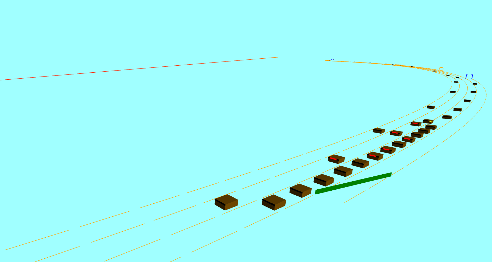

# 道路交通仿真平台 Road Traffic Simulator


此平台可仿真道路交通情况随时间的变化，主要目的是为交通安全/文明宣传教育与研究提供基础支持。

This platform can simulate the road traffic. It aims at providing basic support for publicity, education and research on traffic safety and civilization.




<div style="color: red;">注：当前系统实现的车辆表现仍非常简陋，不能作为现实交通情况的参考。</div>


## 运行 How to run

1、开启文件服务器。Run the file server.

以 Python 自带服务器、本地 10019 端口为例：

```
$ python -m http.server 10019
```


2、浏览器访问。Visit by a browser.

```
http://localhost:10019/frontend/index.html
```

